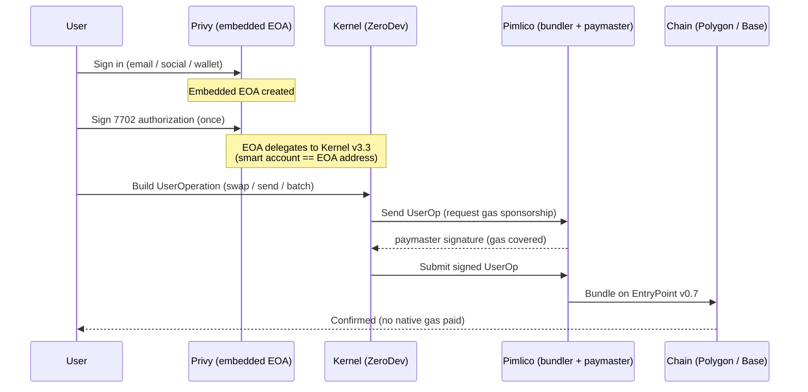

# Account Abstraction Platform

A web wallet / dApp proof-of-concept showcasing **gasless, account-abstracted**
transactions on **Polygon** and **Base**. Users sign in with email or social
login, get an embedded wallet, and can **swap, bridge, send, and batch**
transactions — all **sponsored** (no native gas needed) and signed once.

Built with **EIP-7702 smart accounts** (ZeroDev Kernel) + **ERC-4337**
(Pimlico bundler & paymaster), cross-chain liquidity via **Relay**, and
on-chain data from **Alchemy**.

> ⚠️ This is a POC for demonstration. Use restricted, low-value test keys —
> don't reuse them in production.

---

## ✨ Features

| Feature | What it does |
| --- | --- |
| **Login** | Email OTP, Google/Apple, or an external wallet (Privy embedded wallet, EIP-7702) |
| **Dashboard** | Real token balances + USD value (Alchemy) and a hybrid activity feed (Alchemy transfers + Relay swaps/bridges); rows link to the block explorer |
| **Swap** | Same-chain or cross-chain swap/bridge via Relay, executed as a sponsored UserOperation |
| **Send** | Transfer ERC-20 or native token, gasless |
| **Batch** | Two swaps bundled into **one UserOperation → one signature**, atomic |
| **Export Key** | Self-custody key export via Privy's secure iframe |
| **Dark mode** | Full light/dark theme with a header toggle (persisted, no flash) |

---

## 🧱 Tech stack

- **Next.js 16** (App Router) · **React 19** · **TypeScript**
- **Tailwind CSS v4** + **shadcn/ui** primitives
- **Privy** (`@privy-io/react-auth`) — auth (email / Google / Apple / external wallet), embedded EOA, 7702 authorization, key export
- **ZeroDev Kernel v3.3** (`@zerodev/sdk`) — EIP-7702 smart account
- **Pimlico** (`permissionless`) — ERC-4337 bundler + gas-sponsoring paymaster (EntryPoint v0.7)
- **Relay** (`@relayprotocol/relay-sdk`) — swap/bridge quotes & calldata
- **Alchemy** — Portfolio API (balances + prices) + Transfers API (activity)
- **TanStack Query** — data fetching / caching
- **viem** — chains, encoding, low-level EVM

---

## 🚀 Getting started

### Prerequisites
- **Node.js 20.9+** (tested on 24)
- API keys for **Privy**, **Pimlico**, and **Alchemy** (free tiers work)

### Install & run

```bash
# 1. install dependencies
npm install

# 2. configure environment
cp .env.example .env.local
#    then fill in the keys (see table below)

# 3. start the dev server
npm run dev
```

Open <http://localhost:3000>.

### Environment variables

Copy `.env.example` → `.env.local` and fill in:

| Variable | Scope | Used for |
| --- | --- | --- |
| `NEXT_PUBLIC_PRIVY_APP_ID` | client | Privy auth / embedded wallet |
| `NEXT_PUBLIC_PRIVY_CLIENT_ID` | client | Privy client |
| `PIMLICO_API_KEY` | **server only** | Pimlico bundler + paymaster (proxied via `/api/pimlico`) |
| `ALCHEMY_API_KEY` | **server only** | Balances, prices & activity (via `app/api/*`) |

> `.env.local` is git-ignored. Only the `NEXT_PUBLIC_*` Privy IDs ship to the
> browser (they're public by design) — restrict them by domain in the Privy
> dashboard. The **Pimlico** and **Alchemy** keys are **server-side only**
> (used behind `app/api/*` routes) so they never reach the client.

### Scripts

| Command | Description |
| --- | --- |
| `npm run dev` | Start the dev server |
| `npm run build` | Production build |
| `npm run start` | Serve the production build |
| `npm run lint` | ESLint |
| `npm run typecheck` | `tsc --noEmit` |

---

## ⚙️ How it works

### Smart accounts (EIP-7702 + ERC-4337)



1. **Auth** — Privy provisions an embedded EOA for the user.
2. **7702 upgrade** — the EOA signs an authorization delegating to the **Kernel
   v3.3** implementation, so it behaves as a **smart account at the same
   address** (`hooks/use-smart-account.ts`).
3. **UserOperation** — actions are encoded into a single ERC-4337 UserOp and
   submitted through the **Pimlico bundler**, with the **Pimlico paymaster
   sponsoring gas** (EntryPoint v0.7). The user signs once; **no native token
   is required**.

### Swaps, bridges & batching (Relay)

- We request a quote from **Relay** (`lib/relay/execute.ts` → `getRawQuote`),
  then **extract the calls** (`approve` + `swap`) straight from the quote and
  encode them into a UserOp — we never hand-build approvals.
- **Batch** flattens the calls of **multiple** Relay quotes into **one**
  UserOperation → **one signature, atomic execution** (`executeBatch`).

### Data (Alchemy + Relay)

- **Balances & prices** — `app/api/portfolio` calls Alchemy's Portfolio API
  (`lib/alchemy/portfolio.ts`), filters dust / unpriced tokens, and resolves
  logos.
- **Activity** — `app/api/activity` merges Alchemy transfers
  (`lib/alchemy/activity.ts`) with Relay swap/bridge history
  (`lib/relay/requests.ts`), deduped by tx hash.
- The client consumes both through **TanStack Query** hooks (`hooks/*`).

---

## 🔒 Security notes

- **No infinite approvals.** Swap approvals come from Relay's quote and are
  scoped to the **exact swap amount** (not `type(uint256).max`); the swap
  consumes the allowance, leaving no residual.
- **No token approval to the paymaster.** Pimlico sponsors gas via the
  UserOperation — we don't use an ERC-20 paymaster, so nothing is approved to it.
- **Key export** happens entirely inside **Privy's secure iframe**; the app
  never reads or stores raw private-key material.
- Secrets live only in `.env.local` (git-ignored). The **Alchemy** and
  **Pimlico** keys stay server-side (used only behind `app/api/*`); only the
  Privy App/Client **IDs** reach the browser — and those are public by design
  (identifiers, not secrets).

### Deploy checklist

- [ ] **Privy → Allowed origins**: lock to your real domain(s) only. The App ID /
      Client ID are public (they ship to the browser), so origin allowlisting is
      what stops a cloned / phishing page from using them.
- [ ] **Keep keys server-side**: never add `NEXT_PUBLIC_` to `ALCHEMY_API_KEY` or
      `PIMLICO_API_KEY`.
- [ ] **Pimlico**: gas is sponsored from your Pimlico balance — set a
      sponsorship-policy spend limit. The `/api/pimlico` proxy is same-origin
      intended but open; auth-gate it (verify the Privy session) for production.
- [ ] **No leaked secrets**: confirm none in tracked files, git history, or the
      client bundle before deploying.

---

## 🗂️ Project structure

```
app/
  api/portfolio/route.ts    # Alchemy balances + prices (server)
  api/activity/route.ts     # Alchemy transfers + Relay requests (server)
  layout.tsx                # root layout + no-FOUC theme script
  page.tsx                  # auth gate → login or app shell
  providers.tsx             # client providers (ssr: false)
  globals.css               # Tailwind v4 + design tokens (light/dark)
components/
  providers/                # Privy/web3 + React Query providers
  token-select.tsx          # token dropdown (logo + symbol)
  theme-toggle.tsx          # light/dark switch
config/
  chains.ts                 # supported viem chains
  tokens.ts                 # per-chain swap token lists + logos
features/
  app-shell/                # header, tabs, shell
  login/ dashboard/ swap/ transfer/ batch/ export-key/
  tx/tx-modal.tsx           # Sign → Bundle → Confirm modal
hooks/
  use-smart-account.ts      # Kernel 7702 + Pimlico client
  use-portfolio.ts use-activity.ts use-swap-quote.ts ...
lib/
  aa/        # pimlico url + transfer encoding
  alchemy/   # portfolio + activity fetchers
  relay/     # client, quote/execute, requests
  explorer.ts format.ts
```

---

## 🌐 Supported chains

**Polygon** (137) and **Base** (8453). Relay enables same-chain swaps and
cross-chain bridges between them.
